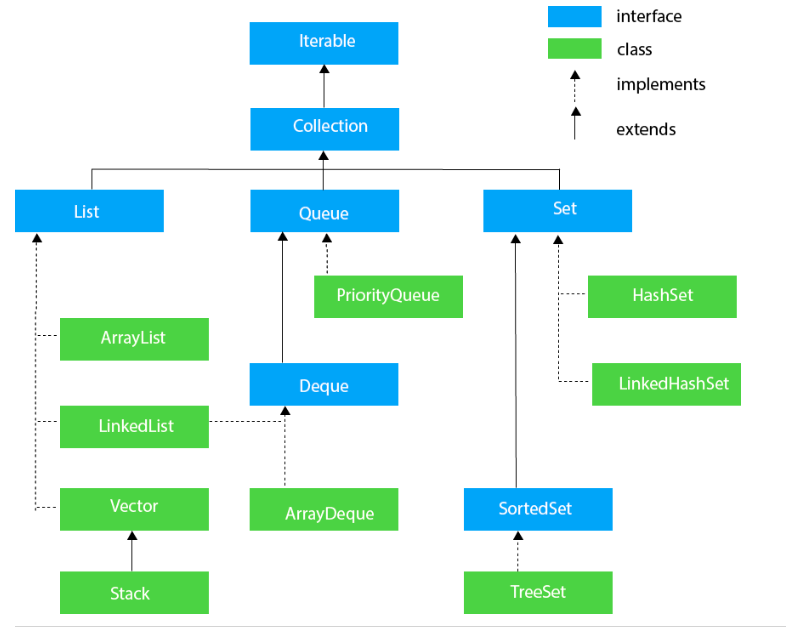
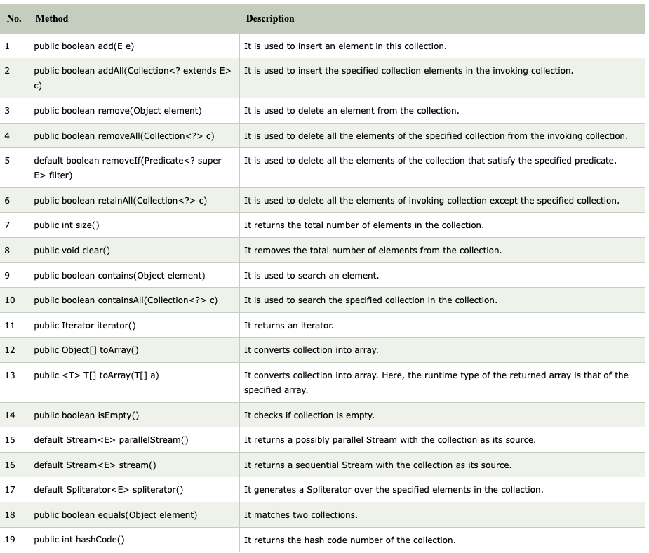

## Collections Framework

The Collection in Java is a framework that provides an architecture to store and manipulate the group of objects.

Java Collections can achieve all the operations that you perform on a data such as searching, sorting, insertion, manipulation, and deletion.

Java Collection means a single unit of objects. Java Collection framework provides many interfaces (Set, List, Queue, Deque) and classes (ArrayList, Vector, LinkedList, PriorityQueue, HashSet, LinkedHashSet, TreeSet).

### Hierarchy

### Methods (appl. to all collections)

Conversions are possible whenever possible and applicable.