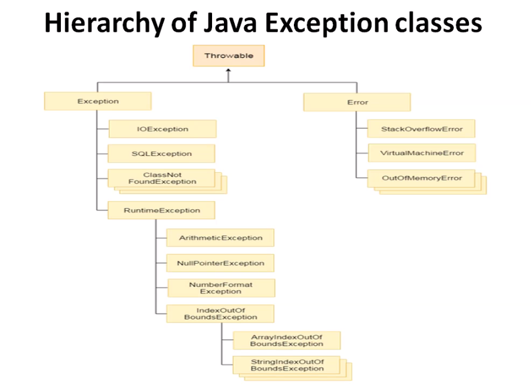

## Exceptions and Exception Handling
### What are Errors?

In any programming language, errors are faults in syntax or logic, that stop the flow of the program. There are usually 2 broad types
1. Compilation Error
2. Run Time Error - Exceptions in JAVA

Exceptions can be handled in JAVA but not errors.
### Hierarchy of Exception Classes

### Errors vs Exception
Exceptions and errors both are subclasses of Throwable class. The error indicates a problem that mainly occurs due to the lack of system resources and our application should not catch these types of problems. Some of the examples of errors are system crash error and out of memory error. Errors mostly occur at runtime that's they belong to an unchecked type. 

Exceptions are the problems which can occur at runtime and compile time. It mainly occurs in the code written by the developers.  Exceptions are divided into two categories such as checked exceptions and unchecked exceptions. 

For Checked vs Unchecked Exceptions with examples check [this resource](https://beginnersbook.com/2013/04/java-checked-unchecked-exceptions-with-examples/).

[Null Pointer Exception](https://www.geeksforgeeks.org/null-pointer-exception-in-java/)
Number Format Exception - thrown by parseXXX() functions on illegal input like alphabets string for parsing int.
Arithmetic Exception - / by 0.
Array Out of Bound Exception - Access index > array/string length.
### Exception Handling

The Exceptions can be handled with try, catch, finally. Note that finally block code will run even if the exception is present and is not handled in the catch block.

Exception Object - contains the exception details.

**more:**

Throw, Throws, User Defined Exception

### User Defined Exceptions

Will be declared and defined as java *class* that extends the class *Exception* with a constructor that sends the exception details to the parent class via super().