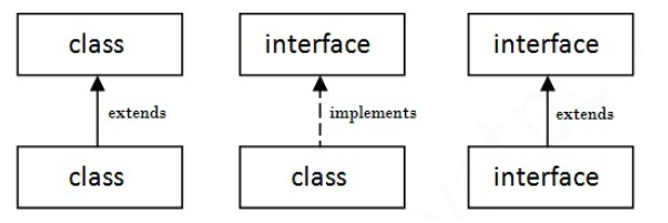

# Inheritance

## Why Inheritance?
1. reusability of code
2. extension of classes 
3. building new class upon the existing one 
4. upgradation 
5. extending its functionality 
6. properties of variable remains same 

## Types of inheritance 
1. single inheritance
2. multiple inheritance (not possible with java class based inheritance) - diamond problem - can be achieved using interface
3. hierarchical inheritance 
4. hybrid inheritance  (not possible with java class based inheritance) - needs interfaces
5. multilevel inheritance  (not possible in java) - can be achieved using interface 

## Abstraction

The idea of hiding certain data and showing only what is essential. Java uses Abstract Classes (0 to 100%) and Interfaces (100%) to achieve this.

### Abstract Classes

**Abstract** Keyword is used for Classes and Methods.

Abstract class: is a restricted class that cannot be used to create objects (to access it, it must be inherited from another class).

Abstract method: can only be used in an abstract class, and it does not have a body. The body is provided by the subclass (inherited from).

### Interfaces

- An interface is a completely "abstract class" that is used to group related methods with empty bodies.
- There can be only abstract methods in the java interface not method body.
- It is used to achieve abstraction and multiple inheritance in Java (wrong program on multiple inheritance).

Note: It cannot be instantiated just like abstract class.
### Inheritance via Classes vs Interfaces

Multiple Inheritance is impossible to implement via Class based inheritance but it is possible via Interfaces

*Association between Classes and Interfaces*

### Overriding

If subclass (child class) has the same method as declared in the parent class, it is known as method overriding in java.

Method overriding is used to provide specific implementation of a method that is already provided by its super class.

Method overriding is used for runtime polymorphism

Rules for Java Method Overriding

1. Method must have same name as in the parent class
2. Method must have same parameter as in the parent class.
3. Must be IS-A relationship (inheritance).

### Super Keyword

Access Parent from Child.

The super keyword in java is a reference variable which is used to refer immediate parent class object.

Whenever you create the instance of subclass, an instance of parent class is created implicitly which is referred by super reference variable.

Usage of java super Keyword: 
1. super can be used to refer immediate parent class instance variable.
2. super can be used to invoke immediate parent class method.
3. super() can be used to invoke immediate parent class constructor.

### Dynamic Method Dispatch and Upcasting

- Dynamic Method Dispatch is a process in which a call to an overridden method is resolved at runtime rather than compile-time.
- Another name for Dynamic Method Dispatch is Run-time polymorphism
- In this process, an overridden method is called through the reference variable of a superclass. The determination of the method to be called is based on the object being referred to by the reference variable.
- When reference variable of Parent class refers to the object of Child class, it is known as upcasting.
- Runtime polymorphism can't be achieved by data members.

Check [this article](https://www.geeksforgeeks.org/dynamic-method-dispatch-runtime-polymorphism-java/) for more.

### Fodder for thought?

Multiple inheritance is not supported through class in java but it is possible by interface, why? Ambiguity/ Diamond Problem

Can we define a class inside the interface? Yes

Similar to nested class…. Is nested interface possible? Yes

