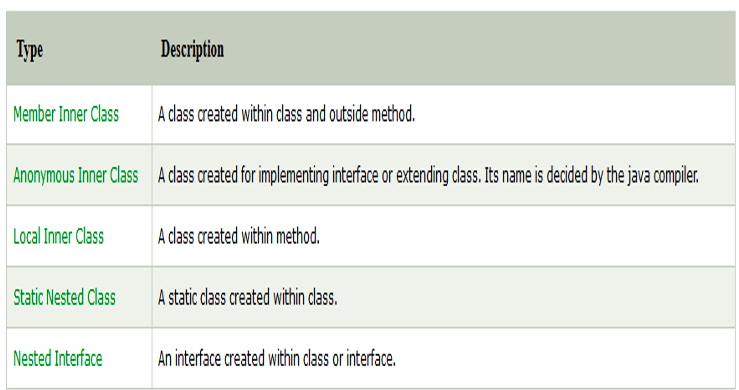

## Inner Classes

Java inner class or nested class is a class which is declared inside the class or interface.
We use inner classes to logically group classes and interfaces in one place so that it can be more readable and maintainable.
Additionally, it can access all the members of outer class including private data members and methods.

## Advantages

There are basically three advantages of inner classes in java. They are as follows:
1. Nested classes represent a special type of relationship that is it can access all the members (data members and methods) of outer class including private.
2. Nested classes are used to develop more readable and maintainable code because it logically group classes and interfaces in one place only.
3. Code Optimization: It requires less code to write.

## Types

There are two types of nested classes 

1. non-static  (inner classes)
2. static nested classes. 

Non-static nested class (inner class) 
1. Member inner class
2. Anonymous inner class
3. Local inner class

Static nested class

Nested Interfaces

## Java Local inner class

- Generally method will be declared  inside a class. But, if a class created inside a method is called local inner class in java.
- If you want to invoke the methods of local inner class, you must instantiate this class inside the method.

### Rules for Local inner class

Rule 1:
Local variable can't be private, public or protected.

Rule 2:
Local inner class cannot be invoked from outside the method.