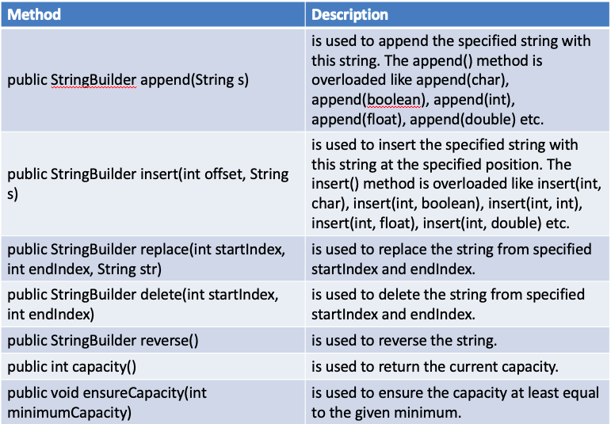

## String Handling in JAVA

In C/C++ - No String DataType - Character Array

In JAVA - Character Array is Different from String datatype

String Immutability

Strings are immutable and their values cannot be changed. Every time a manipulation is done a new string object has to be created.

So for mutable strings -> use String Builder or String Buffer

import java.lang.String - implements Serializable, Comparable and CharSequence interfaces.
### String Methods

Lexicographic Cmp - CompareTo()
Check Substring - Contains()
Equals(), Length(), Replace(), Substring()
String Format

### Comparing Strings

There are three ways to compare string in java:
- By equals() method
  - The String equals() method compares the original content of the string. It compares values of string for equality
  - String class provides two methods: 
    - public boolean equals(Object another) compares this string to the specified object.
    - public boolean equalsIgnoreCase(String another) compares this String to another string, ignoring case.
- By = = operator
- By compareTo() method

**Contains()**

Syntax : public boolean contains(CharSequence sequence)  
searches the sequence of characters in this string. 

It returns true if sequence of char values are found in this string otherwise returns false.

Ex:

String name=“I love java programming 
System.out.println(name.contains(“love java")); 
System.out.println(name.contains(“programming"));
System.out.println(name.contains(“welcome"));  

**String Format** - 

String name=“XXX";  
String sf1=String.format("name is %s",name);  
String sf2=String.format("value is %f",32.33434);
String sf3=String.format("value is %32.12f",32.33434 //returns 12 char fractional part filling with 0    

Output:
name is XXX

value is 32.334340 

value is 32.334340000000

**String Tokenizer**

java.util.StringTokenizer - Break the String into Tokens

*How to initialize?*

StringTokenizer(String str)  -  creates StringTokenizer with specified string.

StringTokenizer(String str, String delim) -creates StringTokenizer with specified string and delimeter.

StringTokenizer(String str, String delim, boolean returnValue) -  creates StringTokenizer with specified string, delimeter and returnValue

*Methods*

Note - Similar functionality can be obtained by using the String Split Method

### String Builder

The java.lang.StringBuilder class is mutable sequence of characters. This provides an API compatible with StringBuffer, but with no guarantee of synchronization.

### String Buffer

The java.lang.StringBuffer class is a thread-safe, mutable sequence of characters. 
Following are the important points about StringBuffer 
- A string buffer is like a String, but can be modified.
- It contains some particular sequence of characters, but the length and content of the sequence can be changed through certain method calls.
- They are safe for use by multiple threads.
- Every string buffer has a capacity.

**ensureCapacity()**

The ensureCapacity() method of StringBuffer class ensures that the given capacity is the minimum to the current capacity. If it is greater than the current capacity, it increases the capacity by (oldcapacity*2)+2. For example if your current capacity is 16, it will be (16*2)+2=34.

### String vs String Builder

### String Buffer vs String Builder

